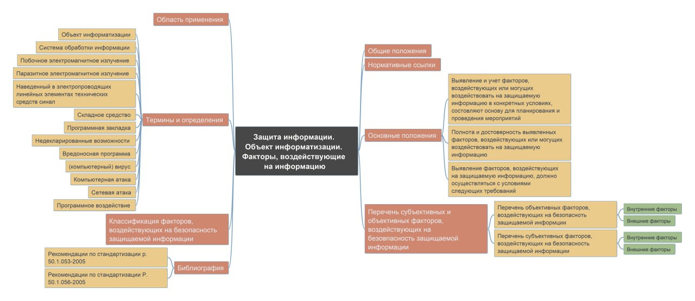

# Практическая работа № 5

## Цель работы

Изучить ГОСТ по защите информации и познакомиться с построением mind-карты

### Ход работы

    1. Для построения mind-карты был взят ГОСТ Р 51275-2006. Защита информации. Основные терминОБЪЕКТ ИНФОРМАТИЗАЦИИ. ФАКТОРЫ, ВОЗДЕЙСТВУЮЩИЕ НА ИНФОРМАЦИЮ.

>Ссылка на документ - https://docs.cntd.ru/document/1200057516

2. Была использована программа Xmind

3. Результат

    

### Оценка результата

    Был изучен ГОСТ Р 51275-2006 г. Защита информации. ОБЪЕКТ ИНФОРМАТИЗАЦИИ. ФАКТОРЫ, ВОЗДЕЙСТВУЮЩИЕ НА ИНФОРМАЦИЮ и была построена mind-карта в программе Xmind.

## Вывод

    Таким образам был изучет ГОСТ и познакомились с посторением mind-карт.